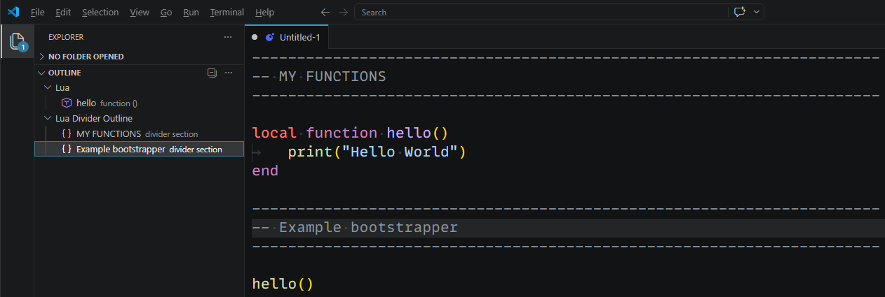

# Lua Divider Outline

[](https://github.com/Cheatoid/lua-divider-outline)
[](https://marketplace.visualstudio.com/items?itemName=Cheatoid.lua-divider-outline)
[](https://marketplace.visualstudio.com/items?itemName=Cheatoid.lua-divider-outline)
[](https://marketplace.visualstudio.com/items?itemName=Cheatoid.lua-divider-outline#review-details)



Simple and useful productivity boost for (large) Lua files. It adds fast, clean navigation for `--` divider sections directly to the Outline (in Explorer tab), making huge single-file Lua modules much easier to scan and jump around.  
Especially useful alongside the **Lua/LuaLS (sumneko)** extension, where your custom sections and actual Lua symbols live together in one navigable structure.

## Main header

The default main-header format is exactly:

```lua
----------------------------------------------------------------------
-- My Section
----------------------------------------------------------------------
```

Both separator lines must contain exactly 70 `-` characters by default. The separator lines are matched as literal lines of dashes; the middle line must be a Lua `--` comment.

Commented separator lines are also accepted:

```lua
-- ----------------------------------------------------------------------
-- My Section
-- ----------------------------------------------------------------------
```

The extension registers a `DocumentSymbolProvider` only for Lua. VS Code merges multiple document-symbol providers, so LuaLS symbols remain available alongside these divider sections.

## One-line subheaders

By default, this also recognizes:

```lua
-- ------------------------------ My Subsection ------------------------------
```

Subheaders are nested beneath the enclosing main header in this extension's symbols.

## Settings

```json
{
  "luaDividerOutline.separatorLength": 70,
  "luaDividerOutline.allowCommentedSeparators": true,
  "luaDividerOutline.subheaders.enabled": true,
  "luaDividerOutline.subheaders.minimumDashLength": 3,
  "luaDividerOutline.subheaders.maximumDashLength": 200
}
```

## Development

Install dependencies:

```bash
npm install
```

Validate the extension JavaScript:

```bash
npm run check
```

Build a VSIX:

```bash
npm run package
```

Build and install the VSIX into your current VS Code installation:

```bash
npm run install:vsix
```

Build, uninstall the currently installed extension, and install the new VSIX:

```bash
npm run reinstall:vsix
```

Or package without requiring repository metadata:

```bash
npm run package:force
```

For development, press `F5` in VS Code to launch an Extension Development Host with this extension loaded. Use `Ctrl+Shift+B` to run the packaging task.
